<p align="center">
   <a href="https://discord.com/users/753887161060818955">
      
   </a>
</p>

## Info -

Hi there, I'm **Aditya Kiran Garud**, an Open Source Developer!

```python
AdityaGarud = {
    "pronouns": {"He", "Him"},
    "country": "India",
    "code": ["Python", "Rust", "Go", "TypeScript", "Embedded C", "IoT Programming"],
    "askMeAbout": ["python dev", "embedded systems", "bot dev", "IoT projects", "traffic management systems"],
}
```
- :computer: My main language is: [Python](https://www.python.org).
- :school: I'm currently learning: Rust, Go, TypeScript, Embedded Systems, AI/ML.

## Where To Find Me -

[](https://github.com/yashranaway)

## Skills -


## OS & Tools -


## Stats -


[](https://github.com/yashranaway)

---

### Auto-generated Metrics:

